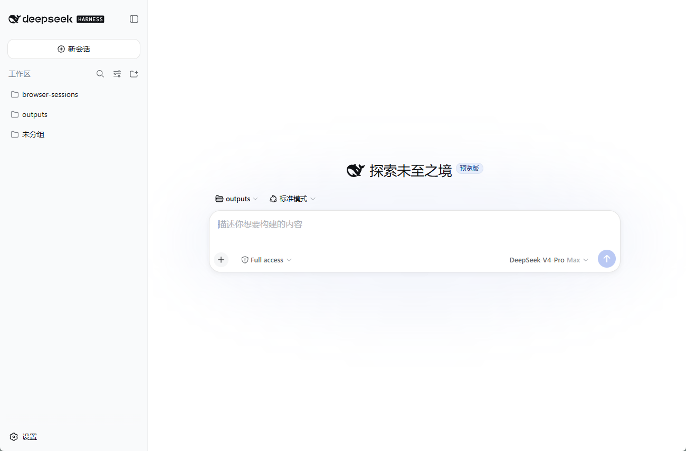

# DeepSeek Harness Window（社区版）

把 [DeepSeek Harness](https://github.com/deepseek-ai/deepseek-harness) 的 Web UI 装进 **Windows 原生独立窗口**（WebView2，即 Edge 内核）的极简启动器。

<p align="center">
  <a href="https://github.com/ZichengGurrr/dsh-window"></a>
  <a href="https://www.npmjs.com/package/dsh-window"></a>
  <a href="LICENSE"></a>
  <a href="https://awesome-dsh-plugin.com"></a>
  
</p>

<p align="center"><strong>简体中文</strong> | <a href="#english">English</a></p>

<p align="center">
  
</p>

- 没有浏览器标签栏、地址栏；任务栏上是自己的图标和窗口
- 不需要 Electron；精简版整个应用约 256KB（4 个文件）
- **便携版双击即用**：自带 Node.js + DSH + Git，无需安装任何环境
- 双击即用：自动检测/启动本地 DSH 服务，就绪后弹窗；关窗即停（服务由它启动时）
- 单实例：重复双击只聚焦已有窗口；记住窗口大小和位置；连不上服务时窗口内一键重试

> ⚠️ **非官方社区项目**，与 DeepSeek 公司无隶属关系。"DeepSeek" 商标归其所有者所有。

## 快速开始

**方式一：DSH 插件（推荐给 DSH 用户）**

```sh
dsh plugin --profile web add dsh-window
```

插件自动从 GitHub Releases 安装应用并创建桌面快捷方式「DeepSeek Harness Window」；对话里说"打开桌面应用"即可通过 `desktop_launch` 工具拉起。详见 [plugin/README.md](plugin/README.md)。

**方式二：便携版（零门槛，任何人）**

1. 从 [Releases](../../releases) 下载 `DeepSeek-Harness-Window-portable-v*-win-x64.zip`
2. 解压到任意目录
3. 双击 `DeepSeek Harness Window.exe`

> 首次运行 Windows SmartScreen 可能拦截（exe 未签名）：点「更多信息 → 仍要运行」即可。

**方式三：精简版（已有 Node 环境）**

1. 下载 `DeepSeek-Harness-Window-v*-win-x64.zip` 并解压（4 个文件）
2. 前提：Windows 10/11、Node.js 装在默认位置 `%LOCALAPPDATA%\Programs\nodejs`、`npm install -g @deepseek-ai/dsh`
3. 双击 `DeepSeek Harness Window.exe`
4. 想一键安装到系统（开始菜单 + 桌面快捷方式 + 控制面板可卸载）：运行 `DeepSeek Harness Window.exe --install`，卸载用 `--uninstall`

## 两种形态

| | 精简版 slim | 便携版 portable |
| --- | --- | --- |
| 大小 | ~256KB | ~180MB |
| 适合 | 开发者、已有 Node 环境的人 | **任何人**，解压双击即用 |
| 前提 | 已装 Node + `npm i -g @deepseek-ai/dsh` | 无 |
| 文件名 | `DeepSeek-Harness-Window-v*-win-x64.zip` | `...-portable-v*-win-x64.zip` |

## 同类桌面壳对比

| | **dsh-window** | [dsh-desktop-windowos](https://github.com/RAFOLIE/dsh-desktop-windowos) | [DeepSeek Harness Desktop](https://github.com/anywhere-labs/deepseek-harness-desktop) |
| --- | --- | --- | --- |
| 安装 | `dsh plugin add dsh-window` / zip | 插件 / 单 exe | 官网安装包 |
| 体积 | 256KB（精简）/ 180MB（便携） | 约 4.5MB | 安装包 |
| 需要 Node | 精简版需要；**便携版不需要** | 需要 | 不需要 |
| 技术栈 | C# + WebView2（系统自带 csc 即可编译） | Tauri v2 + React | Electron |
| 托盘 / 任务完成通知 | 托盘有（`closeToTray`）；通知计划中 | 有 | 有 |

## 原理

DeepSeek Harness 的图形界面本质是一个本地网页（默认 `http://127.0.0.1:3080`）。本程序负责起服务（`dsh --profile web --host 127.0.0.1 --port 3080`），并把"打开浏览器标签页"这一步换成内嵌的 WebView2 窗口。便携版把运行环境（Node、DSH 包、Git）放在程序目录的 `runtime\` 下，优先使用，找不到再回退到系统安装。

## 可选配置

在 exe 同目录放一个 `dsh-window.config.json`（可省略，全部有默认值）：

```json
{
  "host": "127.0.0.1",
  "port": 3080,
  "waitTimeoutMs": 30000,
  "killServerOnClose": true,
  "permissionMode": "danger-full-access",
  "closeToTray": true,
  "checkUpdates": true,
  "updateRepo": "ZichengGurrr/dsh-window",
  "logFile": true
}
```

| 字段 | 默认 | 说明 |
| --- | --- | --- |
| `host` / `port` | `127.0.0.1` / `3080` | 服务地址；改端口即可与其它实例共存 |
| `waitTimeoutMs` | `30000` | 等待服务就绪的超时 |
| `killServerOnClose` | `true` | 服务由本程序启动时，关窗是否一并停止 |
| `permissionMode` | `danger-full-access` | 传给服务的 DSH 权限模式（也可在 Web UI 里改） |
| `closeToTray` | `false` | 点关闭按钮最小化到托盘（托盘菜单：显示主窗口 / 退出） |
| `checkUpdates` | `true` | 启动后检查 GitHub Release 新版本，有新版时页面右下角提示 |
| `updateRepo` | `ZichengGurrr/dsh-window` | 更新检查的仓库 |
| `logFile` | `false` | 写日志到 `%LOCALAPPDATA%\DeepSeekHarnessWindow\launcher.log` |

## 命令行参数

| 参数 | 作用 |
| --- | --- |
| （无） | 确保服务在线，然后打开窗口 |
| `--check` | 只检查运行环境，不启动任何东西 |
| `--no-window` | 只确保服务在线，不打开窗口 |
| `--install` | 一键安装：拷贝到 `%LOCALAPPDATA%\Programs\dsh-window`，创建桌面/开始菜单快捷方式和卸载项 |
| `--uninstall` | 卸载：移除快捷方式、注册表卸载项与安装目录 |

## 从源码构建

依赖：Windows + PowerShell + .NET Framework 4.x（自带 `csc.exe`）。构建脚本自动下载 WebView2 SDK（NuGet）。

```powershell
.\build.ps1                          # 精简版
.\build.ps1 -Portable                # 精简版 + 便携版（自动下载 Node/MinGit、npm 安装 DSH）
.\build.ps1 -Version 1.1.0 -IconPath .\my-icon.ico
.\build.ps1 -Portable -DshVersion 0.1.0-rc.6 -NpmRegistry https://registry.npmmirror.com
```

产物：`dist\`（精简版目录）、`dist-portable\`（便携版目录）及仓库根目录下的 zip。

> 图标是可选的。仓库内不带任何 DeepSeek 官方 logo 素材，请勿在公开分发中使用官方鲸鱼 logo，除非你确认有权使用。

## 常见问题

**便携版为什么这么大？**
Node.js 运行时 + 完整 `@deepseek-ai/dsh` 包 + MinGit。这是"解压即用"的代价；不需要零安装体验就用精简版。

**和直接开浏览器有什么区别？**
服务完全一样，会话数据完全共用（`~/.dsh`）。区别只在窗口形态：独立窗口、独立任务栏图标、关窗即停。

**关掉窗口后还能用浏览器访问吗？**
如果服务本来就在外面跑着（比如命令行 `dsh web`），关窗不影响；服务是这个程序起的且 `killServerOnClose` 为 `true`，会一起停。

**为什么不是单文件 exe？**
WebView2 需要 3 个运行库文件随 exe 分发（含一个原生 DLL）。4 个文件放一个文件夹，体感与单文件无异。

**Windows 弹 SmartScreen 警告？**
exe 未做代码签名，首次运行会被拦：点「更多信息 → 仍要运行」。签名在 Roadmap 中。

## Roadmap

- [x] 作为 DSH 插件分发（`dsh plugin add dsh-window`，含 `desktop_launch` 工具与自动安装/升级）
- [x] 托盘常驻与最小化到托盘（`closeToTray`，点关闭按钮隐藏到托盘）
- [x] 自动检查新版本并在页面内提示（`checkUpdates`）
- [x] 一键安装/卸载（`--install` / `--uninstall`，开始菜单 + 桌面快捷方式 + 控制面板卸载项）
- [ ] 任务完成系统通知（会话 idle 时弹 Toast，可一键唤回窗口）
- [ ] Inno Setup / winget 安装包
- [ ] 代码签名（消除 SmartScreen 警告）

## 相关链接

- 官方仓库：[deepseek-ai/deepseek-harness](https://github.com/deepseek-ai/deepseek-harness)（MIT，Discussions 开放）
- 官方 npm 包：[`@deepseek-ai/dsh`](https://www.npmjs.com/package/@deepseek-ai/dsh)
- 插件精选列表：[awesome-dsh-plugin](https://github.com/awesome-dsh-plugin/awesome-dsh-plugin)
- 其他社区桌面壳：[RAFOLIE/dsh-desktop-windowos](https://github.com/RAFOLIE/dsh-desktop-windowos)、[anywhere-labs/deepseek-harness-desktop](https://github.com/anywhere-labs/deepseek-harness-desktop)、[salathleizhang/deepseek-harness-desktop](https://github.com/salathleizhang/deepseek-harness-desktop)、[ChisaAlter/Deepseek-Harness-Desktop](https://github.com/ChisaAlter/Deepseek-Harness-Desktop)

## License

MIT（见 [LICENSE](LICENSE)）

---

<a id="english"></a>

# DeepSeek Harness Window (community edition)

A minimal launcher that puts the [DeepSeek Harness](https://github.com/deepseek-ai/deepseek-harness) Web UI into a **native standalone Windows window** (WebView2 / Edge engine).

<p align="center">
  
</p>

- No browser tabs or address bar; its own taskbar icon and window
- No Electron; the slim build is ~256KB (4 files)
- **Portable build, double-click and go**: bundles Node.js + DSH + Git, no environment required
- Auto-detects/starts the local DSH service and opens the window when ready; closes the service on exit only when it started it
- Single instance: re-launching focuses the existing window; remembers size/position; one-click retry inside the window when the service is unreachable

> ⚠️ **Community project**, not affiliated with DeepSeek. The "DeepSeek" trademark belongs to its owners.

## Quick start

**Option A: DSH plugin (recommended for DSH users)**

```sh
dsh plugin --profile web add dsh-window
```

The plugin auto-installs the app from GitHub Releases and creates the desktop shortcut "DeepSeek Harness Window"; say "open the desktop app" in chat to launch it via the `desktop_launch` tool. See [plugin/README.md](plugin/README.md).

**Option B: portable build (anyone, zero prerequisites)**

1. Download `DeepSeek-Harness-Window-portable-v*-win-x64.zip` from [Releases](../../releases)
2. Unzip anywhere
3. Double-click `DeepSeek Harness Window.exe`

> First run may hit SmartScreen (the exe is unsigned): click "More info → Run anyway".

**Option C: slim build (Node environment already present)**

1. Download and unzip `DeepSeek-Harness-Window-v*-win-x64.zip` (4 files)
2. Prerequisites: Windows 10/11, Node.js at `%LOCALAPPDATA%\Programs\nodejs`, `npm install -g @deepseek-ai/dsh`
3. Double-click `DeepSeek Harness Window.exe`
4. To install system-wide (start menu + desktop shortcut + control-panel uninstaller): run `DeepSeek Harness Window.exe --install`; remove with `--uninstall`

## Builds

| | slim | portable |
| --- | --- | --- |
| Size | ~256KB | ~180MB |
| For | developers with Node already set up | **anyone**, unzip and double-click |
| Prerequisites | Node + `npm i -g @deepseek-ai/dsh` | none |
| File | `DeepSeek-Harness-Window-v*-win-x64.zip` | `...-portable-v*-win-x64.zip` |

## How it works

The DeepSeek Harness GUI is a local web page (default `http://127.0.0.1:3080`). This app starts the service (`dsh --profile web --host 127.0.0.1 --port 3080`) and replaces the "open a browser tab" step with an embedded WebView2 window. The portable build keeps the runtime (Node, the DSH package, Git) under `runtime\` and falls back to the system install when missing.

## Optional config

Drop a `dsh-window.config.json` next to the exe (all keys optional):

```json
{
  "host": "127.0.0.1",
  "port": 3080,
  "waitTimeoutMs": 30000,
  "killServerOnClose": true,
  "permissionMode": "danger-full-access",
  "closeToTray": true,
  "checkUpdates": true,
  "updateRepo": "ZichengGurrr/dsh-window",
  "logFile": true
}
```

| Key | Default | Meaning |
| --- | --- | --- |
| `host` / `port` | `127.0.0.1` / `3080` | Service address; change the port to coexist with other instances |
| `waitTimeoutMs` | `30000` | Service readiness timeout |
| `killServerOnClose` | `true` | Stop the service on window close when this app started it |
| `permissionMode` | `danger-full-access` | DSH permission mode passed to the service (changeable in the Web UI) |
| `closeToTray` | `false` | Minimize to tray on close (tray menu: show window / quit) |
| `checkUpdates` | `true` | Check GitHub Releases on startup and show an in-page banner when a new version exists |
| `updateRepo` | `ZichengGurrr/dsh-window` | Repository used for the update check |
| `logFile` | `false` | Write logs to `%LOCALAPPDATA%\DeepSeekHarnessWindow\launcher.log` |

## Command-line arguments

| Argument | Effect |
| --- | --- |
| (none) | Ensure the service is online, then open the window |
| `--check` | Only check the runtime environment, start nothing |
| `--no-window` | Only ensure the service is online, open no window |
| `--install` | One-click install: copies to `%LOCALAPPDATA%\Programs\dsh-window`, creates desktop/start-menu shortcuts and an uninstall entry |
| `--uninstall` | Uninstall: removes shortcuts, the registry entry, and the install directory |

## Building from source

Prerequisites: Windows + PowerShell + .NET Framework 4.x (bundled `csc.exe`). The build script downloads the WebView2 SDK (NuGet) automatically.

```powershell
.\build.ps1                          # slim build
.\build.ps1 -Portable                # slim + portable (downloads Node/MinGit, npm-installs DSH)
.\build.ps1 -Version 1.1.0 -IconPath .\my-icon.ico
.\build.ps1 -Portable -DshVersion 0.1.0-rc.6 -NpmRegistry https://registry.npmmirror.com
```

Output: `dist\` (slim), `dist-portable\` (portable), and zips in the repo root.

> The icon is optional. This repo ships no DeepSeek logo assets; do not use the official whale logo in public distribution unless you are sure you have the rights.

## FAQ

**Why is the portable build so big?**
Node.js runtime + the full `@deepseek-ai/dsh` package + MinGit. That is the price of unzip-and-go; use the slim build when you already have Node.

**How is this different from opening a browser?**
The service is identical and sessions are fully shared (`~/.dsh`). The difference is window chrome only: standalone window, own taskbar icon, close-to-stop.

**Can I still use the browser after closing the window?**
Yes, when the service was already running externally (e.g. `dsh web` in a terminal). When this app started the service and `killServerOnClose` is `true`, closing the window stops it.

**Why not a single-file exe?**
WebView2 needs 3 runtime files shipped beside the exe (including a native DLL). Four files in one folder feel the same as a single file.

**Windows shows a SmartScreen warning?**
The exe is not code-signed yet, so the first run is blocked: click "More info → Run anyway". Signing is on the roadmap.

## Roadmap

- [x] DSH plugin distribution (`dsh plugin add dsh-window`, `desktop_launch` tool, auto-install/upgrade)
- [x] Tray residency and minimize-to-tray (`closeToTray`, X button hides to tray)
- [x] Automatic update check with an in-page banner (`checkUpdates`)
- [x] One-click install/uninstall (`--install` / `--uninstall`, start-menu + desktop shortcuts, control-panel entry)
- [ ] Task-done system notification (toast when the session goes idle, one click to restore the window)
- [ ] Inno Setup / winget package
- [ ] Code signing (removes the SmartScreen warning)

## Links

- Official repo: [deepseek-ai/deepseek-harness](https://github.com/deepseek-ai/deepseek-harness) (MIT, Discussions open)
- Official npm package: [`@deepseek-ai/dsh`](https://www.npmjs.com/package/@deepseek-ai/dsh)
- Curated plugin list: [awesome-dsh-plugin](https://github.com/awesome-dsh-plugin/awesome-dsh-plugin)
- Other community desktop shells: [RAFOLIE/dsh-desktop-windowos](https://github.com/RAFOLIE/dsh-desktop-windowos), [anywhere-labs/deepseek-harness-desktop](https://github.com/anywhere-labs/deepseek-harness-desktop), [salathleizhang/deepseek-harness-desktop](https://github.com/salathleizhang/deepseek-harness-desktop), [ChisaAlter/Deepseek-Harness-Desktop](https://github.com/ChisaAlter/Deepseek-Harness-Desktop)

## License

MIT (see [LICENSE](LICENSE))
